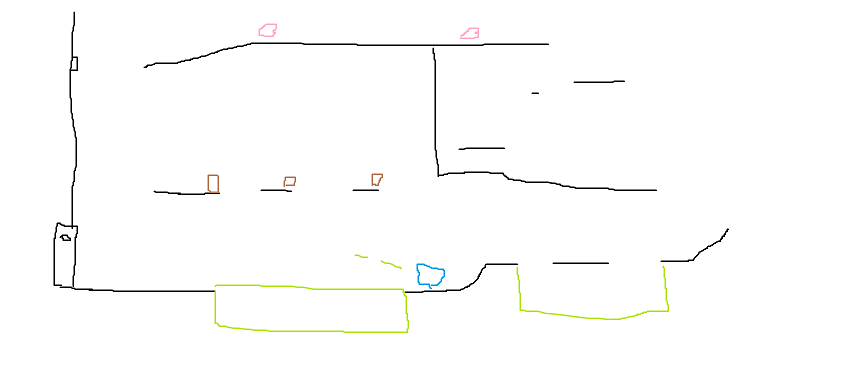

## Nomes:
Henrique souza, Pedro romanatto, Felipe noguchi
## Objetivo:
O objetivo da fase é abrir a porta que ta atras de você, para isso você tera que subir para atirar no objeto e ativa-lo para a porta abrir
## Estilo do level:
Plataforma e Missão com progressão linear
## Esboço:

https://assetstore.unity.com/packages/templates/tutorials/2d-game-kit-107098
